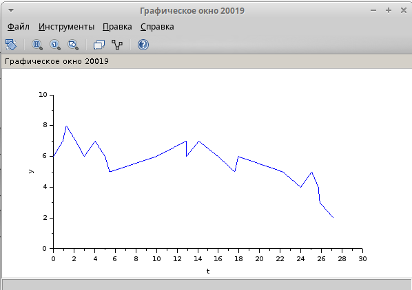

---
## Front matter
lang: ru-RU
title: Лабораторная работа 7
subtitle: Модель M|M|1|
author:
  "- Герра Гарсия Паола Валентина"
institute:
  "- Российский университет дружбы народов, Москва, Россия"

## i18n babel
##babel-lang: russian
##babel-otherlangs: english

## I18n polyglossia
polyglossia-lang:
  name: russian
  options:
	- spelling=modern
	- babelshorthands=true
polyglossia-otherlangs:
	name: english

## Formatting pdf
#toc: false
#toc-title: Содержание
slide_level: 2
aspectratio: 169
section-titles: true
theme: metropolis
header-includes:
 - \metroset{progressbar=frametitle,sectionpage=progressbar,numbering=fraction}
 - '\makeatletter'
 - '\beamer@ignorenonframefalse'
 - '\makeatother'
---

# Информация

## Докладчик

:::::::::::::: {.columns align=center}
::: {.column width="60%"}

  * Герра Гарсия Паола Валентина
  * студентка
  * Российский университет дружбы народов
  * [1032225472@pfur.ru](mailto:1032225472@pfur.ru)
  * <https://github.com/paovalentinag10/labs/tree/main>

:::
::: {.column width="25%"}

:::
::::::::::::::

## Цель работы

Рассмотреть пример моделирования в *xcos* системы массового обслуживания типа $M|M|1|\infty$.

## Задание

1. Реализовать модель системы массового обслуживания типа $M|M|1|\infty$;
2. Построить график поступления и обработки заявок;
3. Построить график динамики размера очереди.

## Выполнение лабораторной работы

{#fig:001 width=70%}

## Выполнение лабораторной работы

{#fig:002 width=50%}

## Выполнение лабораторной работы

{#fig:003 width=50%}

## Выполнение лабораторной работы

{#fig:004 width=50%}

## Выполнение лабораторной работы

{#fig:005 width=60%}

## Выполнение лабораторной работы

{#fig:006 width=50%}

## Выводы

В процессе выполнения данной лабораторной работы я рассмотрела пример моделирования в *xcos* системы массового обслуживания типа $M|M|1|\infty$.
